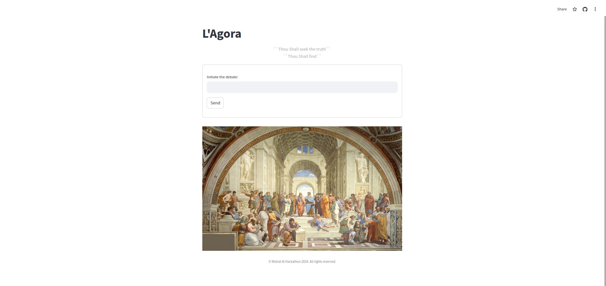

# L'Agora

L'Agora is a conversational platform powered by AI that facilitates philosophical debates between different personas. It leverages state-of-the-art natural language processing techniques to simulate dialogues reminiscent of historical philosophical discussions.

## Motivation

The motivation behind L'Agora stems from a desire to create an engaging and educational platform where users can explore philosophical concepts through interactive conversations. By incorporating AI-driven personas representing famous philosophers, users can engage in thought-provoking dialogues and gain insights into various philosophical perspectives.

## Architecture

## Usage

1. Enter a prompt or question in the input box.
2. Click "Send" to initiate the conversation.
3. Engage in dialogue with AI-driven personas representing famous philosophers.
4. Download the conversation transcript by clicking the "Download Report" button.

## Technologies Used

- Streamlit: For building the interactive web application.
- Python: For backend logic and AI-driven conversation generation.
- Langchain/LangGraph: For natural language processing and dialogue management.

## Installation

To run L'Agora locally, follow these steps:

1. Clone this repository.
2. Install the required dependencies using `pip install -r requirements.txt`.
3. Run the Streamlit app using `streamlit run app.py`.

## Contributors

- I wanna thank me! Ad Mistral AI

## License

This project is licensed under the [MIT License](LICENSE).
